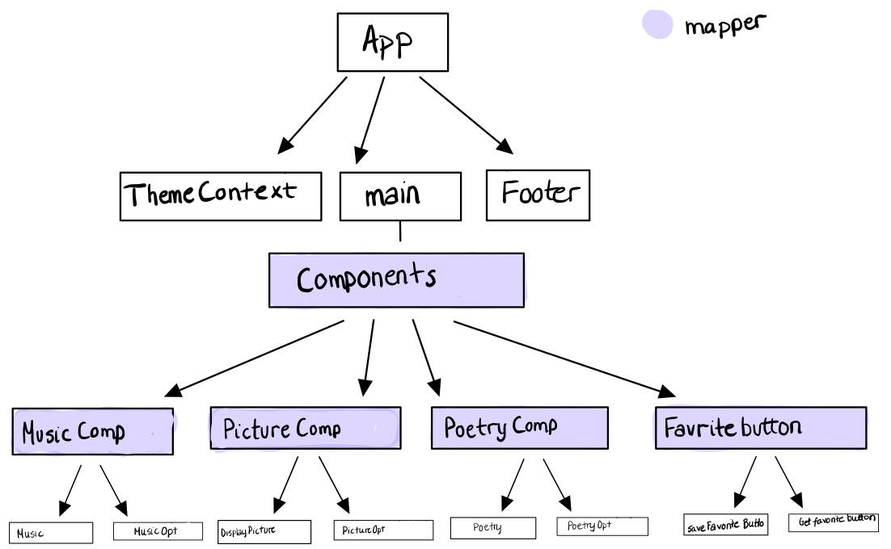

 

Løsning på prosjekt 2 i Webutvikling - IT2810. I samarbeid med Siw Døvle og Ragnhild Øie Langåker

# Project 2

Prosjekt 2 i Webutvikling - Gruppe 51

Nettsiden vår er en single page application (SPA) som forestiller et galleri. Galleriet har ulike installasjoner bestående av bilde, dikt og lyd som brukeren kan endre etter eget ønske.

## Teknologi

### React, JSX og Typescript

Dette prosjektet er laget i React med bruk av JSX for å gjøre det lettere å skrive HTML i React. JSX gjør blant annet at man kan ha markering og logikk i samme fil. Da blir det også enklere for React og vise feilmeldinger på kode som kan by på problemer. I tillegg blir det enklere å visualisere hvordan koden henger sammen, for eksempel hvordan events blir håndtert eller hvordan state endrer seg over tid. Prosjektet er implementert med Typescript for å få bedre kontroll på typer og for å validere at koden fungerer på ønsket måte.

### Node.js and NPM

NPM er en "package manager" som blant annet består av en kommandolinje-klient. Det er også verdens største bibliotek for pakker, og disse er det enkelt å hente ut fra nettet via kommandolinjen. Vi benyttet create-react-app med et Typescript template til å komme i gang med prosjektet slik at NPM tok seg av alt det tekniske rundt pakker, konfigurasjoner og moduler.

### Organisering av filer

Nettsiden er i hovedsak laget med funksjonelle komponenter. Dette er fordi vi ikke kunne react fra før og fokuserte dermed på å lære oss den måten som er mest populær i markedet for øyeblikket.

Vi valgte å dele opp funksjonaliteten i mindre deler for å følge React sin filosofi om å ha mindre komponenter med en oppgave.

App - har kontroll på alle underliggende komponenter og sender Theme videre ved hjelp av ThemeProvider

Main - tar seg av state management og sender props videre til de andre komponentene

DisplayPicture - viser svg-animasjon basert på “PictureNo” prop

Poetry - henter inn poems basert på “poerty” prop

Music - viser audio ved hjelp av “musicNo” prop

PictureOpt, PoetryOpt og MusicOpt - inneholder radiobuttons som oppdaterer “pictureNo, poetryNo og musicNo”

ThemeContext - oppbevarer og setter themeName

Vi bruker context til å lage en ThemeProvider som vi kan bruke til å pakke inn alle komponenter. Slik slipper vi å sende ThemeName til alle komponenter.

### SVG

Svg-animasjonene:

Singin ball: https://codepen.io/z-mamba-san/pen/MWyrNbe

Abstract triangles: https://codepen.io/mrmarley2/pen/VwaEKXw

Tree: https://codepen.io/natvoc/details/MWywgeK?fbclid=IwAR2MKLjJecSjjLKpZYsWlTmFJFrttZFfxASKaIstZgyZwPcl7CbDHfKWJ0U

### AJAX

Vi benyttet fetch()-funksjonen til AJAX for å hente diktene fortløpende fra PoetryDB (poetrydb.org/index.html). Vi lagret URL-ene i en liste, hentet de med fetch, og brukte useEffect og useState til å oppdatere etter hver render. Når vi henter JSON filer på denne måten kan vi presentere det vi henter hvordan vi vil, ved blant annet bruk av mapping og parsing.

### Audio

Lyden løste vi ved å legge til .mp3 filer lokalt som vi hentet fra www.fesliyanstudios.com.

Lyd1(https://www.fesliyanstudios.com/royalty-free-music/downloads-c/happy-music/2)

Lyd2(https://www.fesliyanstudios.com/royalty-free-music/downloads-c/epic-music/4)

Lyd3(https://www.fesliyanstudios.com/royalty-free-sound-effects-download/wind-blowing-37)

Disse filene ble lagt i media-mappe og importert til Music.tsx. Bruker audiotaggen med kontroller for å kunne spille av musikken. Komponenten tar imot props fra main som bestemmer hvilken lyd som skal avspilles.

### HTML WEB STORAGE

Vi har valgt å bruke Localstorage til en favoritt knapp. Når brukeren har huket av på ønsket radiobuttons kan valgene lagres ved å trykke på "Save favorite". Da vil localstorage ta vare på de valgte verdiene og disse kan så hentes frem igjen ved å trykke på “Get favorite”. Ved localstorage forsvinner ikke verdiene etter at siden er lukket og dermed vil brukeren fortsatt ha favoritten sin neste gang siden besøkes.
Vi lagrer kontinuerlig de valgte radiobuttons verdiene i sessionStorage, dette er for at siden skal ha samme tilstand om den oppdateres. Altså vil radiobuttons kun nullstille seg til default om siden lukkes.

### Testing

Jest er et test rammeverk som fungere bra med Javascript og Typescript. Create-react-app setter Jest automatisk opp som testrammeverk, så vi kan skrive tester med en gang uten noen ekstra konfigurasjoner. Vi har forholdt oss til Jest sin enkle filosofi og brukt snapshottester. En snapshottest lagerer et skjermbilde av hvordan komponenten ser ut og skulle det skje en endring så sier den ifra. Dette gjør det enkelt å oppdage endringer og konrollere om de er hensiktsmessige, før man tar et nytt snapshot med den oppdaterte koden. Slik vil man ha bedre kontroll på utviklingen av kode.

#### Testing responsiv

For å teste om siden var responsiv brukte vi ulike metoder. Testet først med å justere browser vinduet. For så å gå over til å teste på ulike enheter:

- Bærebar PC
  - Macbook pro 13
  - Huawei MateBook X Pro,
- Nettbrett
  - Ipad air 2
  - Ipad pro
- Mobil
  - Samsung galaxy s9
  - Huawei mate 20 pro
  - Iphone x

Testet både i høyde- og breddeformat. Har også testet i ulike browsere:

- Edge
- Safari
- Chrome

I safari ble hjertene i radiobutton litt små men dette går ikke utover funksjonaliteten.

### Responsive Web Design

Vi prøvde først å bruke css grid for å gjøre siden responsiv. Siden en jobbet med responsivness i CSS grid og en med styling og flex ble det vanskelig å slå de sammen. Vi valgte derfor å bruke flex da ønsket var at elementene skulle komme nedenfor hverandre når siden ble mindre. Brukte viewport (100vh) på startpage height for at den skulle være 100 % av de ulike enhetenes høyde. Det ble brukt pixler på tekst og radio buttons, uten “welcome-text” fordi vi ønsket at denne skulle endre seg i forhold til vindustørrelse. For å få siden funksjonell på mobil brukte vi media queries.

### Git

I git har vi hatt fokus på å ha issues som beskriver arbeidsoppgaven som skal gjøres. Og at man utfra issuen lager en branch med tilhørende nummer og navn som f. eks.: 11-write-documentation. Dette binder hver commit til en issue, og gjør det enklere å forstå hva som gjøres og er gjort. Har også lagt til labels sånn at det skal være lettere å se hvordan issues som hører sammen. Vi fant ut litt seint at vi ikke ville merge rett i master, men ha en mellomlagring først. Vi bestemte oss da for å lage en branch som vi kalte pre-master. For så på slutten å merge pre-master inn i master.
